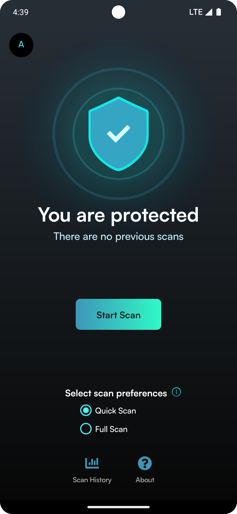
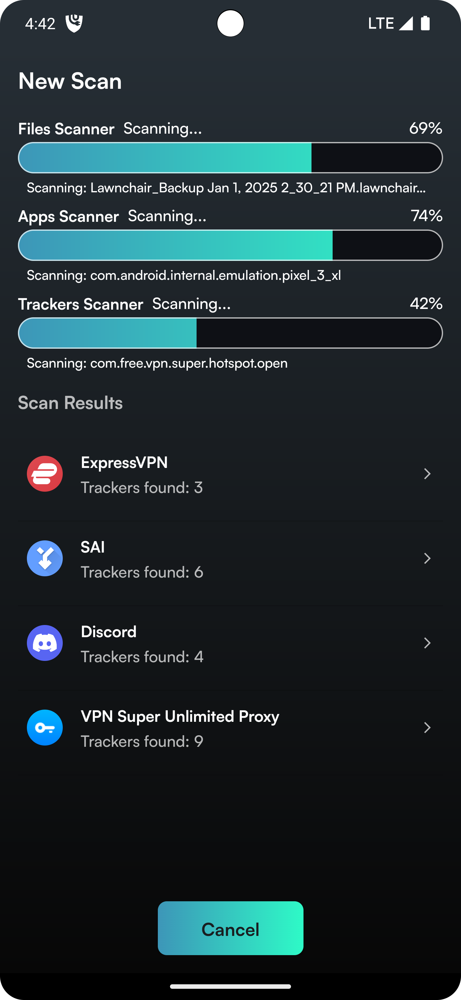
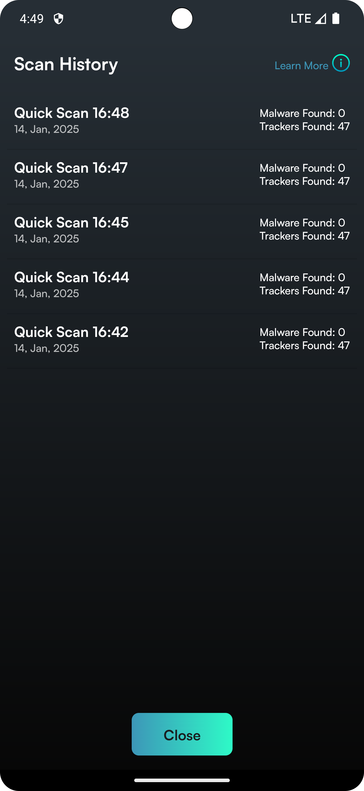
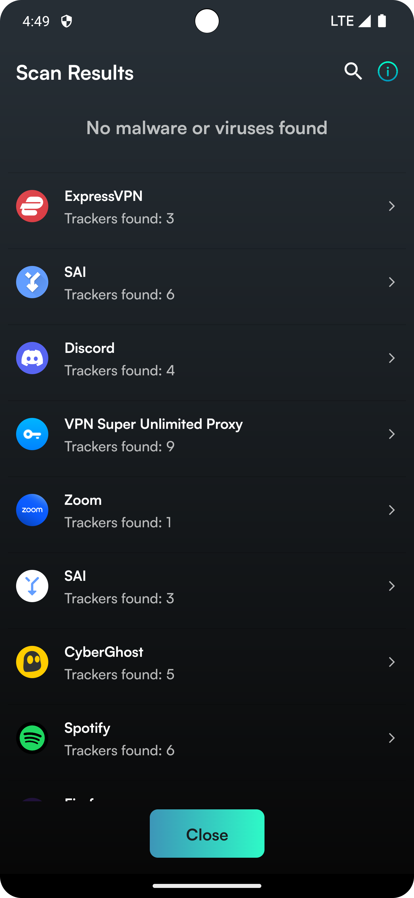
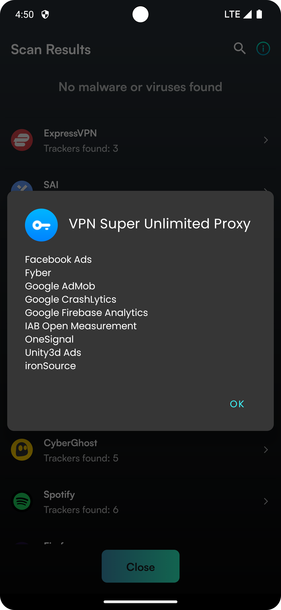

# **Unplugged Antivirus and Tracker Detection App**

**A comprehensive antivirus and tracker detection solution designed to protect Android devices from malicious apps, files, and threats, while maintaining user privacy.**



## **Table of Contents**
- [Introduction](#introduction)
- [Open Source Details](#open-source-details)
- [Features](#features)
- [Installation](#installation)
- [Reporting Bugs](#reporting-bugs)
- [Contributing](#contributing)
- [License](#license)
- [Acknowledgments](#acknowledgments)
- [Contact](#contact)


## **Introduction**

This project provides Android users with a robust antivirus and tracker detection application based on:
- The popular malware module, **Hypatia**.
- The advanced tracker module, **TrackerControl**.
- Our custom **Package Scanner** and **Signature Database**.

The app is designed for users concerned about their digital privacy and security, offering real-time protection and advanced tracking detection. It is lightweight, efficient, and easy to use.


## **Open Source Details**

### **[Hypatia - Malware Scanner](https://github.com/Divested-Mobile/Hypatia)**
This application incorporates the Hypatia Malware Scanner to:
- Scan the device for malicious apps and files containing viruses or malware.
- Provide an in-depth analysis of system files, enabling scans of `/system`, internal storage, external storage, and installed apps.
- Operate completely offline: Internet access is only required to download signature databases. No files are ever sent off the device.

**Note:** The published code in this project points its malware database to Hypatia's servers. Unplugged's Antivirus releases use a malware database hosted on Unplugged's servers.

### **[TrackerControl - Tracker Scanner](https://github.com/TrackerControl/tracker-control-android)**
This application integrates TrackerControl to:
- Scan installed apps for built-in trackers and display detailed results.
- Operate entirely offline: Tracker data is stored locally within the TrackerControl extension and not downloaded from the Internet.

### **Unplugged Module: Signature Scanner**
In addition to the open-source modules, Unplugged has developed its own **Signature Scanner** to:
- Identify known infected package signatures on the device.
- Regularly update the signature database with indicators of compromised or infected apps.
- Provide detailed insights into detected threats and recommend actions to secure the device.

**Note:** This published code has an example database for the Signature Scanner. You should use this example to create your own signature database.


## **Features**

- Real-time virus, malware, and tracker scanning with threat detection.
- A user-friendly interface designed for easy navigation.
- Detailed reports on detected threats and trackers, equipped with search functionality.
- Lightweight and optimized for Android devices.


## **Installation**

### **Prerequisites**
- Android Studio.
- Android device or Android Emulator.
- Internet connection (for updates and threat database synchronization).

### **Steps to Install**
1. Clone the repository:
   ```bash
   git clone https://github.com/werunplugged/UP-Antivirus.git
   ```
2. Open the project in Android Studio.
3. Sync the project with Gradle files.
4. Build and install the application on your Android device or emulator.

### **Basic Usage**
1. Launch the app on your Android device.
2. Tap the **Scan** button to perform a scan.
3. View scan history on the **History** page.
4. In the **History** page, tap a specific scan entry to view detailed results, complete with a built-in search feature.

### **Configuration Details**
- Customize app settings in the **Settings** menu.
- Enable or disable features based on your preferences.


## Reporting bugs

A great bug report contains a description of the problem and steps to reproduce it. We need to know what to look for and where to look for it.
When reporting a bug, please make sure to provide the following information:
- A full description of the issue, including screenshots if possible.
- Steps to reproduce the issue.
- UP Antivirus version.
- Device / OS information.


## **Contributing**

We welcome contributions to this project! To contribute:
1. Fork the repository and create a new branch for your feature or fix.
2. Ensure your code adheres to the project's coding standards.
3. Submit a pull request with a clear description of your changes.
4. Report issues or suggest features via the issue tracker.


## **License**

This project is licensed under the [AGPL 3.0 License](LICENSE). This fork inherits the license from the original project.


## **Acknowledgments**

We extend our gratitude to:
- The original authors for their foundational work.
- Contributors and community members for their valuable input.
- Open-source libraries and tools used in this project.


## **Contact**

For questions or comments about **UP Antivirus**, contact **[Unplugged Support](mailto:support@unplugged.com)**.